### Oi, eu sou a Isabelly 

* 🌱 Estudante de Engenharia de Software
* 💼 Buscando novos desafios e oportunidades em tecnologia (Foco em Full-Stack)
* ⚡ Pronomes: ela/dela

---

### 🛠️ Tecnologias e Ferramentas
* **Frontend:** HTML5, CSS3, JavaScript, TypeScript, Angular
* **Controle de Versão:** Git, GitHub

---

### 📊 Estatísticas do GitHub

  

  

<!--

  <a href="https://github.com/isazh1">
   
  

--> 

 
